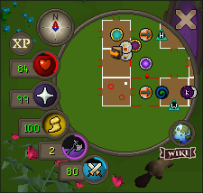

[![MIT License][license-shield]][license-url]

 

  

<h3 align="center">Soulreaper Axe QoL</h3>

#### Features

* Displays an additional minimap orb to track Soulreaper Axe stacks & special attack at the same time
* Track the remaining time until you lose a Soulreaper Axe stack
* Change the colour of both the special attack & Soulreaper Axe minimap orbs
 

#### Soulreaper Axe equipped

#### Soulreaper Axe unequipped with one or more stacks remaining

#### Fixed mode - show text on orb enabled

#### Theme select - matches some packs from the Resource Packs plugin

#### Custom colour options

<a href="#readme-top">back to top</a>

[license-shield]: https://img.shields.io/github/license/seacelery/soulreaper-axe-qol.svg?style=for-the-badge
[license-url]: https://github.com/seacelery/soulreaper-axe-qol/blob/master/LICENSE.txt